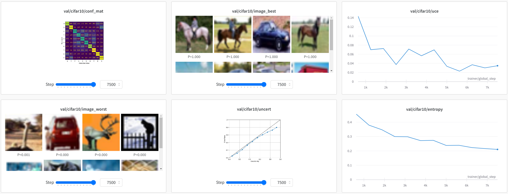

# DL-Template

[](https://circleci.com/gh/TidalPaladin/dl-template/tree/master)
[](https://codecov.io/gh/TidalPaladin/dl-template)


A template repository for deep learning using PyTorch. The core objective of this
template is to minimize the latency between idea and implementation. Once a foundational model
has been built, iterating on that model should be a fast and easy process. 

**This template is still a work in progress, but should be in a useable state.**

Some cool logging features:
  * Captioned images for top-k and bottom-k predictions based on error
  * Plot of error rate vs uncertainty (entropy)
  * Confusion matrix




## Installation

To pull the Combustion submodule and initialize a virtual environment, run

```
make init
```

You are now ready to run the default CIFAR-10 demo with

```
venv/bin/python -m project
```

## Theory


### Dataclasses

This template makes extensive use of [dataclasses](https://docs.python.org/3/library/dataclasses.html)
to organize model inputs and outputs. Having tried a few different approaches (raw tensors, tuples, dicts, etc.),
I chose dataclasses for the following advantages:
  * Support for static type hints and type checking
  * Named field access facilitates addition or removal of fields
  * Easy to associate methods with the data they manipulate
  * Inheritance and polymorphism

The following dataclasses are key pieces of this pipeline:
  * `Example` - A training/testing example, including inputs and label
  * `Prediction` - Model output
  * `Loss` - Organizes losses (for models with multiple loss functions)

### Model Inheritance

Inheritance can be a helpful tool when iterating on variants of a model. This template attempts to pack a complete
set of methods and features into a `BaseModel` class, from which all other model inherit. When implementing a number
of slightly different models, inheritance should be leveraged where possible in order to avoid duplication of 
related code.

### Callbacks

[Callbacks](https://pytorch-lightning.readthedocs.io/en/stable/extensions/callbacks.html) are used to implement
pieces of the training pipeline that are non-essential. This includes logging of visualizations and non-essential
metrics. The reasons for this approach are:
  * Reduces pollution of model code with non-essential logic
  * Callbacks are reusable across tasks
  * If model variant is incompatible with a callback, disabling that callback is trivial

### Key Libraries

#### [PyTorch Lightning](https://github.com/PytorchLightning/pytorch-lightning)
High level API for PyTorch. The user implements methods that define the various steps and stages of a pipeline, and
PyTorch Lightning calls these methods in the proper order. It also handles things like GPU/multi-GPU/TPU training.

#### [TorchMetrics](https://github.com/PytorchLightning/metrics)
Library of PyTorch metrics. Notably, it provides automatic handling of metric computation in distributed training 
environments.

#### [Lightning Bolts](https://github.com/PyTorchLightning/lightning-bolts)
Toolbox of models and datasets. Provides some handy `LightningDataModule` implementations for popular datasets
(like CIFAR-10, used by this template).

#### [Weights and Biases](https://wandb.ai/site)
W&B is an experiment tracking tool. It is similar to TensorBoard, but far more feature rich. 
As this pipeline runs, training progress is logged to W&B. I run a self-hosted W&B instance to which results 
are logged (see [this](https://docs.wandb.ai/guides/self-hosted/local).

#### [Combustion](https://github.com/TidalPaladin/combustion)
My own library of helpful tools. DL-Template only relies on Combustion for a few things


## Usage

General instructions for adapting this template to your own task:
  1. Rename the default project name (`project`) to whatever you like
  2. In `project/data`, implement any `Dataset` classes you need
  3. In `project/data`, a `LightningDataModule` for each of your datasets
  4. In `project/structs/example.py`, modify the `Example` dataclass as needed
  5. In `project/structs/prediction.py`, modify the `Prediction` dataclass as needed
  6. In `project/structs/loss.py`, modify the `Loss` dataclass as needed
  7. In `project/metrics`, implement metric wrappers for any metrics you need
  8. In `project/model`, implement a subclass of `BaseModel` with your model code
  9. In `project/callbacks`, implement any callbacks you need (for logging, etc.)


## Development

Multiple make recipes are provided to aid in development:
* `quality` - Runs code quality tests
* `style` - Automatically formats code (using `black` and `autopep8`)
* `test` - Runs all tests
* `test-%` - Runs specific tests by pattern match (via `pytest -k` flag)
* `test-pdb-%` - Runs specific tests with debugging on failure (via `pytest --pdb` flag)
